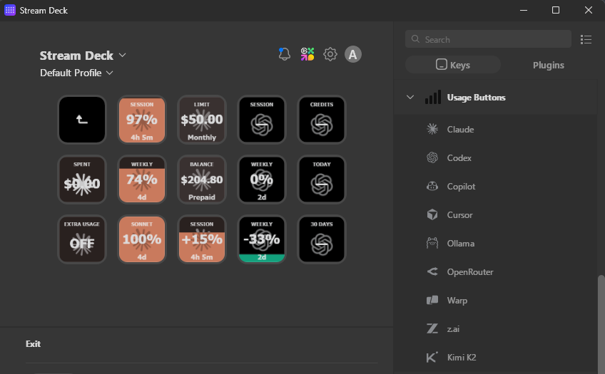
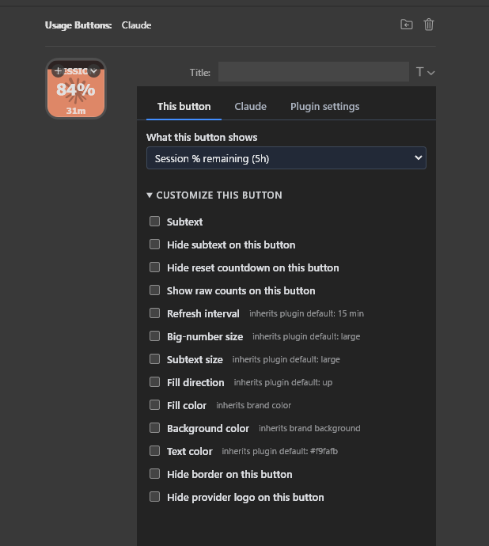
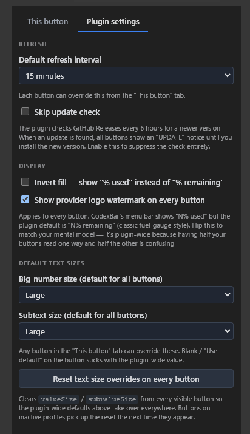

# UsageButtons

Stream Deck plugin that turns every AI-coding-assistant usage stat into a
live button — session % remaining, weekly %, credits, reset countdowns,
per-model quotas, and more. Each button renders a dynamic icon whose
background fills (or de-fills) in proportion to the current value, so
you can tell at a glance how much runway you have left.



Inspired by [CodexBar](https://github.com/steipete/CodexBar) for macOS.
Runs on **Windows and macOS**.

## Settings

Each provider is its own action — drag **Claude**, **Codex**, **Copilot**,
etc. onto a key and configure the metric, colors, and thresholds from the
Property Inspector.

| Per-button settings | Plugin-wide defaults |
|---|---|
|  |  |

## Runtime

Written in **Go**. Compiles to a single static binary per platform —
no runtime dependencies. End users just install the plugin; the
Stream Deck software launches the binary directly.

- **Single binary**, no runtime dependencies
- **Low memory footprint**
- **Only external dep**: [coder/websocket](https://github.com/coder/websocket)

## Repo layout

```
UsageButtons/
├── io.github.anthonybaldwin.UsageButtons.sdPlugin/  # Stream Deck plugin bundle
│   ├── manifest.json
│   ├── ui/                               # Property Inspector HTML
│   ├── assets/                           # icons shipped with the plugin
│   └── bin/                              # compiled binaries (gitignored)
├── cmd/
│   ├── plugin/                           # Go entry point
│   └── native-host/                      # Chrome native-messaging bridge
├── chrome-extension/                     # MV3 companion extension (fetch-proxy)
├── internal/
│   ├── streamdeck/                       # SD WebSocket protocol
│   ├── render/                           # SVG button renderer + bbox
│   ├── cookies/                          # browser fetch-proxy client + bridge
│   ├── providers/                        # provider interface, cache, mock
│   │   ├── claude/                       # Claude (OAuth + browser web API)
│   │   ├── codex/                        # Codex (OAuth)
│   │   ├── cookieaux/                    # cookie-gated provider messaging helpers
│   │   ├── copilot/                      # GitHub Copilot
│   │   ├── cursor/                       # Cursor (browser)
│   │   ├── ollama/                       # Ollama (browser)
│   │   ├── openrouter/                   # OpenRouter (API key)
│   │   ├── warp/                         # Warp (GraphQL)
│   │   ├── zai/                          # z.ai (API token)
│   │   └── kimik2/                       # Kimi K2 (API key)
│   ├── settings/                         # global + per-key settings
│   ├── icons/                            # provider SVG glyph paths
│   ├── update/                           # GitHub Releases update checker
│   └── httputil/                         # shared HTTP+JSON helpers
├── scripts/                              # build, release, icon generation
├── tmp/CodexBar/                         # upstream reference (gitignored)
├── CLAUDE.md                             # Claude-specific agent notes
├── AGENTS.md                             # shared agent instructions
└── README.md
```

## Install

The full step-by-step lives on the
[landing page](https://anthonybaldwin.github.io/UsageButtons/#install).
Short version:

1. Download the **.streamDeckPlugin** bundle for your OS from the
   [latest release](https://github.com/anthonybaldwin/UsageButtons/releases/latest)
   and double-click to install in Stream Deck.
2. (Optional, for Claude extras / Cursor / Ollama) Grab
   **UsageButtons-Helper-unpacked.zip** from the same release, unzip
   it, and **Load unpacked** in `chrome://extensions`. The plugin
   auto-registers — nothing to configure.
3. Drag a provider (**Claude**, **Codex**, **Copilot**, etc.) onto a
   Stream Deck key and pick a metric from the Property Inspector.

## Build from source

```
git clone https://github.com/anthonybaldwin/UsageButtons.git
cd UsageButtons
go build -o io.github.anthonybaldwin.UsageButtons.sdPlugin/bin/plugin-win.exe ./cmd/plugin/
go build -o io.github.anthonybaldwin.UsageButtons.sdPlugin/bin/usagebuttons-native-host-win.exe ./cmd/native-host/
./scripts/install-dev.sh --restart
```

`install-dev.sh` junctions the `.sdPlugin` folder into Stream Deck's
plugin directory so rebuilds take effect without reinstalling.
Cross-compile with `GOOS=darwin GOARCH=arm64 go build ...` for macOS
(and the same for the native host — releases build both arches via
the `release` workflow).

Full dev workflow lives in [AGENTS.md](AGENTS.md).

## Releases

Cut via the manual `release` GitHub Action — no local git work:

```
gh workflow run release.yml --field bump=patch
gh workflow run release.yml --field bump=minor
gh workflow run release.yml --field bump=custom --field custom_version=0.4.0
gh workflow run release.yml --field bump=patch --field draft=true  # draft release
```

The workflow bumps both manifests, tags, builds plugin + native host
for Windows + macOS (both arches), packages the Helper zip, and
publishes the release with all three artifacts attached.

## Usage Buttons Helper (required for Claude extras, Cursor, Ollama)

Claude's web extras (balance / overage), Cursor, and Ollama sit
behind Cloudflare and need a logged-in browser session. Usage
Buttons ships a small Chrome extension — **Usage Buttons Helper** —
in [`chrome-extension/`](chrome-extension/) that proxies `fetch()`
for those three sites. Your usage reads happen through your real
browser session; cookies never leave Chrome.

- **No credentials in the plugin.** `credentials: "include"` +
  Chrome's native cookie jar. The plugin only sees API response
  bodies.
- **Narrow by design.** Hardcoded to fetch only `claude.ai`,
  `cursor.com`, and `ollama.com` — enforced in the manifest's
  `host_permissions` AND again in the service worker at request
  time. No `cookies` permission, no broad host scope.
- **One-click install.** The extension's ID is pinned by its public
  key, so the plugin auto-registers the native-messaging bridge on
  launch — download the release zip, Load Unpacked in
  `chrome://extensions`, done.
- **Providers that don't need it keep working unchanged** — Claude
  OAuth, Codex, Copilot, OpenRouter, Warp, z.ai, Kimi K2 never touch
  the extension path.
- **Waits patiently on cold start.** Cookie-gated buttons stay in a
  quiet "needs browser extension" state until the extension
  handshakes — so launching Stream Deck before Chrome doesn't
  trigger a 403 loop.

Install steps live in the [Helper README](chrome-extension/README.md).
Works in any Chromium-based browser (Chrome, Edge, Brave, Chromium);
a Firefox port is on the roadmap.

## License

[MIT](LICENSE) · [Third-party licenses](THIRD_PARTY_LICENSES.md)

---


